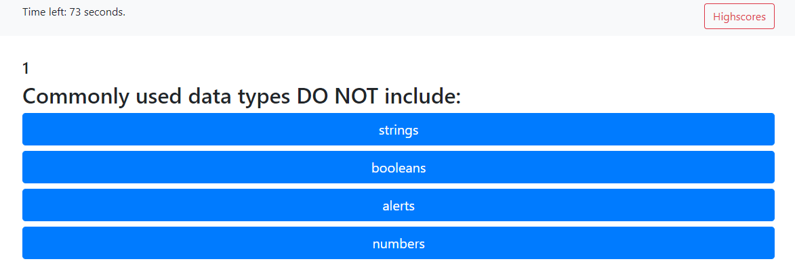
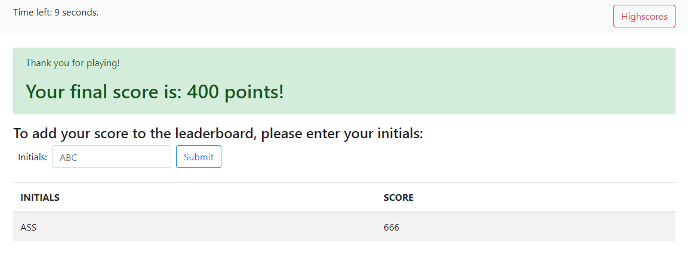

# Dynamically Generated JS Quiz

***Author: Corey S. Capstick***

This application is designed to test users' knowledge of JavaScript

## Purpose

The purpose of this project is to showcase my ability to code the logic required to create a basic quiz application using Vanilla JavaScript.  Ultimately, the students who completed this homework assignement were challenged to demonstrate their ability to use the plainest possible syntax possible. 

## Technologies used

The application uses *Bootstrap 4,* javascript, and css.

## Functionality

1. The user is welcomed by a welcome card set in a Jumbotron.
2. When the "Start Quiz" button is pressed, it triggers the following:
   * A timer starts running at the top of the screen.
   * A link to the highscores in local storage is displayed at the top of the screen.
   * The first question is displayed.
3. The application will wait until an answer is clicked before displaying the next question. The user will see a green message if the answer is correct, and a red message if the answer is wrong. 
4. The timer will stop running when the user has anwered all the questions, or if the timer reaches 0 (zero) seconds.
5. The user will accumulate 100 points per correct question answered during the quiz. 
6. After the quiz is completed, the user can see their final score, and they have the option to add their score and initials to the highscores.

## User interface
### Welcome Box 

### Questions Rendered 

### Score Board 

## Deployed Application Link 
IF you would like to try the quiz you may do so [here](https://ccx20k.github.io/vanilla-code-quiz/.)